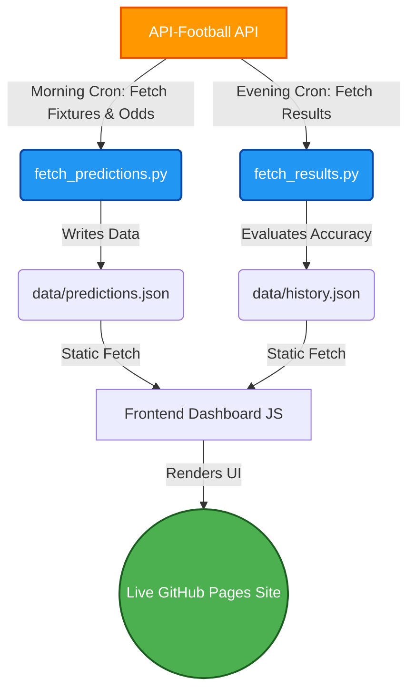

<div align="center">
  
  
  <h1 align="center">AI-Powered Football Predictions ⚽</h1>

  <p align="center">
    <strong>A Fully Automated, VIP-style Football Prediction Dashboard driven by advanced Machine Learning.</strong>
    <br />
    <br />
    <a href="https://karidasd.github.io/football-predictions/"><strong>🔴 View Live Dashboard</strong></a>
    ·
    <a href="https://github.com/karidasd/football-predictions/issues">Report Bug</a>
    ·
    <a href="https://github.com/karidasd/football-predictions/issues">Request Feature</a>
  </p>

  <p align="center">
    
    
    
    
    
  </p>
</div>

---

## 🌟 About The Project

This repository hosts a state-of-the-art, **serverless** football betting predictions platform. By leveraging the internal Machine Learning engine of **API-Football**, it calculates highly accurate probabilities, detects betting odds discrepancies, and presents the most profitable daily plays in a beautiful, neon-glassmorphism user interface.

No database, no backend servers. Everything runs entirely on **GitHub Actions** and **GitHub Pages**.

### ✨ Key Features

- **🧠 Advanced AI Engine:** Fetches Match Winner (1X2), Over/Under, and Both Teams to Score (GG/NG) probabilities using mature Machine Learning algorithms.
- **💎 VIP Bet of the Day:** An intelligent scanning system that evaluates all daily fixtures and promotes the single highest Expected Value (EV) bet to the top of the dashboard.
- **📈 Live Value Bet Detection:** Automatically pulls pre-match odds from top bookmakers (e.g., Bet365) and flags mathematical edge opportunities (where `Probability * Odds > 1.0`).
- **🤖 100% CI/CD Automation:**
  - **🌅 Morning Cron (06:00 UTC):** Wakes up, queries the API, calculates stats, writes to `predictions.json`, and deploys the new frontend automatically.
  - **🌃 Evening Cron (23:00 UTC):** Audits the day's matches, grabs final scores, grades the AI's performance, and logs accuracy to `history.json`.

---

## 🏗️ System Architecture

This project is an elegant showcase of **Data-Driven Static Site Generation (SSG)** via CI/CD.



---

## 🚀 Getting Started Locally

To get a local copy up and running, follow these simple steps.

### Prerequisites
- Python 3.8+
- An API key from [API-Football](https://www.api-football.com/)

### Installation

1. Clone the repo
   ```sh
   git clone https://github.com/karidasd/football-predictions.git
   ```
2. Navigate to the project folder
   ```sh
   cd football-predictions
   ```
3. Set your API Key in your environment variables:
   ```sh
   # On Windows (PowerShell)
   $env:API_FOOTBALL_KEY="ENTER_YOUR_API_KEY_HERE"
   
   # On Mac/Linux
   export API_FOOTBALL_KEY="ENTER_YOUR_API_KEY_HERE"
   ```
4. Run the data fetcher to generate fresh predictions:
   ```sh
   python scripts/fetch_predictions.py
   ```
5. Open `index.html` in any modern web browser to view the dashboard!

---

## 🎨 UI/UX Design

The dashboard is built from scratch using pure HTML, CSS, and Vanilla JavaScript, ensuring zero bloat and lightning-fast loading speeds.
- **Glassmorphism:** Semi-transparent cards with frosted glass effects.
- **Responsive Layout:** CSS Grid & Flexbox utilized for a seamless mobile and desktop experience.
- **Dynamic Progress Bars:** Color-coded visualization of the AI's confidence levels.

---

## 📝 License

Distributed under the MIT License. This is a personal project created for educational, portfolio, and demonstration purposes. Not intended as financial advice.

<div align="center">
  <p>Built with ❤️ and 🤖</p>
</div>
